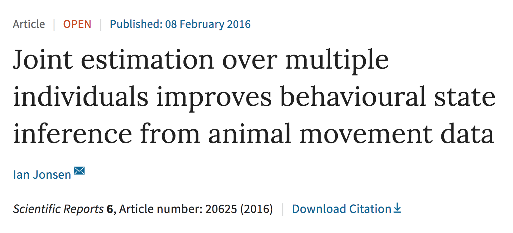

---
output:
  xaringan::moon_reader:
    chakra: libs/remark-latest.min.js
    css: "my-theme.css"
    lib_dir: libs
    nature:
      highlightStyle: github
      highlightLines: true
---

```{r setup, include=FALSE, message=FALSE}
options(htmltools.dir.version = FALSE, servr.daemon = TRUE)
library(huxtable)
```

class: center, middle, inverse

# IMPROVED UNDERSTANDING OF FISHERIES & ECOSYSTEMS FROM NOISY & DISPARATE DATA
## Mark Scheuerell
_Northwest Fisheries Science Center<br>National Marine Fisheries Service<br>_
<br>
_School of Aquatic and Fishery Sciences<br>University of Washington<br>_

.futnote[`r icon::fa("envelope")` mark.scheuerell@noaa.gov]

.citation[`r icon::fa("twitter")` @mark_scheuerell]

---

# Acknowledgments

.large.blue-text[
### Elizabeth Holmes, Jim Thorson, Eric Ward (NMFS)

### Eric Buhle, Kevin See (Quantitative Consultants, Inc)

### Stephanie Hampton, Steve Katz (Washington St Univ)

### Daniel Schindler, Ray Hilborn (Univ Washington)

### Brice Semmens (Scripps)
]

---

# Acknowledgments

.large.blue-text[
## Post-docs

## Grad students

## Undergrads

## _Many_ others
]

---

class: frimg, center 
background-image: url(figs/mit_fire_hose.jpg)
background-size: cover

.white-text[
# I hope you're thirsty!
]

---

# A brief outline

1. Introduction
.small[
* My story  
* Emergence of cool stuff
* The future of cool stuff
* Can we get through all of this?
]
2. Methods
.small[
* Old school stats
* New school stats
* Software improvements
* Hardware is not soft
]
3. Results
.small[
* Some plots
* Unrelated tangent
* Really hard-to-read table
* Horrendogram
]
4. Discussion
.small[
* Where is this headed?
* So much inference
* Did we get through all of this?
* When is he done?
]
5. Supplement
.small[
* There's more?!
* Who does this in a talk?
]

---

class: frimg

background-image: url(figs/minnesota.jpg)
background-size: 70%

---

class: frimg

background-image: url(figs/wisconsin.jpg)
background-size: 75%

---

class: frimgB, center

# I was trained as a field ecologist


---

# My early research was largely empirical

.green-text[
## Nutrient limitation of lake productivity
]
.blue-text.center[
## Vertical migration in juvenile sockeye salmon
]
.orange-text.right[
## Trophic interactions among stream fishes
]

---

class: center, middle, inverse

# Many scientific advances

---

class: frimg

background-image: url(figs/remote_sensing.jpg)
background-size: 100%

# Remote sensing

---

class: frimg, center

background-image: url(figs/dna.png)
background-size: 100%

# Genetics

---

class: frimg, right

background-image: url(figs/stats.png)
background-size: 90%

# Analysis

---

# My current research themes

.green-text[
## Models for spatio-temporal data
]
.blue-text.center[
## Integrated population models
]
.orange-text.right[
## Ecological portfolios
]

---

class: center

# *Methods in Ecology and Evolution*

```{r timeseries, dpi=300, fig.height=4, fig.width=6, out.height="80%", out.width="80%", fig.align='center', echo=FALSE}
mee <- data.frame(yr=seq(2010,2017),
                  issues=c(4,6,6,12,12,12,12,12),
                  imp=c(NA,5.1,6,6.6,7.4,8.1,8.6,9.9))

pd <- as.matrix(mee[,-1])

par(mfrow=c(2,1), mai=c(0.3,0.4,0.3,0), omi=c(0.1,0,0,0))
## top panel
bp <- barplot(height=rep(NA,8), las=1, ylim=c(0,13),
              col="#488fdf", border=NA, space=1,
              ylab="",
              cex.lab=1.4, yaxt="n")
abline(h=seq(0,12,3), col="gray")
text(0, 1.15*par()$usr[4], cex=1.4,
     "Issues per year", xpd=NA, pos=4)
barplot(height=mee$issues, las=1, add=TRUE,
        col="#488fdf", border=NA, space=1,
        ylab="Issues per year",
        cex.lab=1.4, yaxt="n")
axis(2, at=seq(0,12,3), las=1, tick=FALSE, cex.axis=1.2)
## bottom panel
barplot(height=rep(NA,8), las=1,
        col="darkblue", border=NA, space=1,
        ylim=c(0,11),
        ylab="", cex.lab=1.4, yaxt="n")
abline(h=seq(0,10,2), col="gray")
text(0, 1.15*par()$usr[4], cex=1.4,
     "Impact factor", xpd=NA, pos=4)
barplot(height=mee$imp, las=1, names.arg=mee$yr, add=TRUE,
        col="#ff8100", space=1, border=NA,
        cex.names=1.2,
        ylab="", cex.lab=1.4, yaxt="n")
axis(2, at=seq(0,10,2), las=1, tick=FALSE, cex.axis=1.2)
text(bp[1],1,"NA",col="darkgray", adj=c(0.5,0.5))
```

---

class: center, middle, inverse

# Lots of focus on *hierarchical models*

---

class: frimg, center
background-image: url(figs/horrified.jpg)
background-size: cover

---

# Hi·er·ar·chi·cal

### *adjective*

1. ## Arranged in an order

---

class: center, middle, inverse

# A hierarchical model is simply
# a model within a model

---

# Hierarchical models also masquerade as

.blue-text[
## Nested data models
## Mixed models
## Random-effects models
## State-space models
]

---

class: center, middle, inverse

# A state-space model has 2 parts

---

# Part 1: State model

## Describes the .blue-text[true state of nature] over time or space

```{r state_diag, dpi=300, fig.height=4, fig.width=8, out.height="100%", out.width="100%", fig.align='center', echo=FALSE, warning=FALSE}
par(mai=c(0.8,0.8,0,0), omi=rep(0,4))
## boundaries
ss <- 5
nn <- 7
rr <- ss*3
cc <- ss*nn
## mid-points
xm <- ss/2 + seq(0,cc-ss,ss)
ymt <- rr - ss/2
ymb <- ss/2
## arrow locs
x0t <- seq(ss, by=2*ss, len=3)
x1t <- x0t + ss
## empty plot space
plot(c(0,cc), c(0,rr), type="n", xlab="", ylab="",
     xaxt="n", yaxt="n", bty="n")
## top row: state
symbols(x=xm[c(1,3,5,7)], y=rep(ymt,4), circles=rep(ss/2,4),
        lty="solid",  fg=NA, bg="#488fdf",
        inches=FALSE, add=TRUE, lwd=3)
text("Truth", x=-ss, y=ymt, adj=c(0,0.5), xpd=NA,
     cex=2, col="#488fdf")
arrows(x0=x0t,x1=x1t,y0=ymt, col="#488fdf", lwd=3, length=0.12)
## Time or space
arrows(x0=ss/2, x1=cc-ss/2, y0=-ss/3+ss*2,
       length=0.12, lwd=3, xpd=NA)
text("Time or space", x=cc/2, y=-ss/2+ss*2, xpd=NA, pos=1, cex=2)
```

---

# States of nature might be

.blue-text[
## Animal location
## Species density
## Age structure
## Reproductive status
]

---

class: center, middle, inverse

# Revealing the true state of nature
# requires some observations

---

class: frimg, center, bottom, inverse-black
background-image: url(figs/venice_carnival.jpg)
background-position: 50% 50%
background-size: 100%

---

class: center, middle, inverse

# Observing nature can be easy

---

class: frimg, bottom, right
background-image: url(figs/sockeye.jpg)
background-size: cover

# .white-text[How many salmon are there?]

---

class: center, middle, inverse

# Observing nature can also be hard

---

class: frimg, bottom, right
background-image: url(figs/sockeye.jpg)
background-size: cover

# .white-text[How many mayflies are there?]

---

# Part 2: Observation model

## .purple-text[Data] = .blue-text[Truth] &#177; .red-text[Errors]

---

# Part 2: Observation model

## .purple-text[Data] = .blue-text[Truth] &#177; .red-text[Errors]

```{r obs_diag, dpi=300, fig.height=4, fig.width=8, out.height="100%", out.width="100%", fig.align='center', echo=FALSE, warning=FALSE}
par(mai=c(0.8,0.8,0,0), omi=rep(0,4))
## arrow locs
x0t <- seq(ss, by=2*ss, len=3)
x1t <- x0t + ss
y0b <- rr - ss
y1b <- ss
## empty plot space
plot(c(0,cc), c(0,rr), type="n", xlab="", ylab="",
     xaxt="n", yaxt="n", bty="n")
## top row: state
symbols(x=xm[c(1,3,5,7)], y=rep(ymt,4), circles=rep(ss/2,4),
        lty="solid",  fg=NA, bg="#488fdf",
        inches=FALSE, add=TRUE, lwd=3)
text("Truth", x=-ss, y=ymt, adj=c(0,0.5), xpd=NA,
     cex=2, col="#488fdf")
## arrows
arrows(x0=x0t,x1=x1t,y0=ymt, col="#488fdf", lwd=3, length=0.12)
## bottom row: obs
symbols(x=xm[c(1,3,5,7)], y=rep(ss/2,4), circles=rep(ss/2,4),
        lty="solid",  fg=NA, bg="#844870",
        inches=FALSE, add=TRUE, lwd=3)
text("Data", x=-ss, y=ss/2, adj=c(0,0.5), xpd=NA,
     cex=2, col="#844870")
## arrows
arrows(x0=xm[c(1,3,5,7)], y0=y0b, y1=y1b,
       col="#c10101", lwd=3, length=0.12)
## Time or space
arrows(x0=ss/2, x1=cc-ss/2, y0=-ss/3,
       length=0.12, lwd=3, xpd=NA)
text("Time or space", x=cc/2, y=-ss/2, xpd=NA, pos=1, cex=2)
```

---

class: inverse, center, middle

# OK, but why bother?

---

# Advantages of hierarchical models

## 1. Can combine many different .purple-text[data types]

.center.purple-text[
### Changes in observers or sensors

### Varying survey locations & effort

### Direct & remote sampling  
]

---

# Advantages of hierarchical models

## 2. .gray-text[Missing data] are easily accommodated

```{r obs_NA, dpi=300, fig.height=4, fig.width=8, out.height="90%", out.width="90%", fig.align='center', echo=FALSE, warning=FALSE}
par(mai=c(0.8,0.8,0,0), omi=rep(0,4))
## arrow locs
x0t <- seq(ss, by=2*ss, len=3)
x1t <- x0t + ss
y0b <- rr - ss
y1b <- ss
## empty plot space
plot(c(0,cc), c(0,rr), type="n", xlab="", ylab="",
     xaxt="n", yaxt="n", bty="n")
## top row: state
symbols(x=xm[c(1,3,5,7)], y=rep(ymt,4), circles=rep(ss/2,4),
        lty="solid",  fg=NA, bg="#488fdf",
        inches=FALSE, add=TRUE, lwd=3)
text("Truth", x=-ss, y=ymt, adj=c(0,0.5), xpd=NA,
     cex=2, col="#488fdf")
## arrows
arrows(x0=x0t,x1=x1t,y0=ymt, col="#488fdf", lwd=3, length=0.12)
## bottom row: obs
symbols(x=xm[c(1,3,7)], y=rep(ss/2,3), circles=rep(ss/2,3),
        lty="solid",  fg=NA, bg="#844870",
        inches=FALSE, add=TRUE, lwd=3)
text("Data", x=-ss, y=ss/2, adj=c(0,0.5), xpd=NA,
     cex=2, col="#844870")
## NA's
symbols(x=xm[5], y=ss/2, circles=ss/2,
        lty="solid",  fg=NA, bg="#656565",
        inches=FALSE, add=TRUE, lwd=3)
text("NA", x=xm[5], y=ss/2, cex=1.8, col="#ffffff")
## arrows
arrows(x0=xm[c(1,3,7)], y0=y0b, y1=y1b,
       col="#c10101", lwd=3, length=0.12)
## Time or space
arrows(x0=ss/2, x1=cc-ss/2, y0=-ss/3,
       length=0.12, lwd=3, xpd=NA)
text("Time or space", x=cc/2, y=-ss/2, xpd=NA, pos=1, cex=2)
```

---

class: frimg

# Advantages of hierarchical models

## 3. Improved accuracy & precision

.img-center-land[]

---

# Advantages of hierarchical models

## 4. Rather flexible

.center.blue-text[
### This simple model can be used for 5+ unique applications!
]

$$\LARGE \mathbf{x}_t = \mathbf{B} \mathbf{x}_{t-1} + \mathbf{w}_t \\
  \LARGE \mathbf{y}_t = \mathbf{Z} \mathbf{x}_t + \mathbf{v}_t$$

---

class: inverse, center, middle

# How do I actually do this?

---

# Many software options

## .blue-text[Canned **R** packages] (dlm, vars, MARSS<sup>*</sup>)

## .blue-text[Code-your-own] (JAGS, Stan, greta)

.footnoteSm.gray-text[
<sup>\*</sup>See Holmes, Ward, Scheuerell (2018) _Analysis of multivariate time-series using the MARSS package_
]

---

class: frimg, inverse-black
background-image: url(figs/snake_oil.jpg)
background-size: cover

---

# Conservation of Pacific salmon

.blue-text[
## More than one-half of the stocks in the lower 48 are listed under the Endangered Species Act
]

---

class: center

### .wh-text[-]

.pull-left.middle[
.green-text[
# .large[ Hydropower ]
]
.orange-text[
# .large[ Harvest ]
]
]
.pull-right[
.purple-text[
# .large[ Habitat ]
]
.blue-text[
# .large[ Hatcheries ]
]
]

# .large[ The 4 H's ]

---

class: inverse, center, middle

# .large[ RECOVERY OPTIONS? ]

---

class: frimg
background-image: url(figs/suppl_scheme.png)
background-position: 50% 60%
background-size: 90%

# One strategy is .blue-text[hatchery supplementation]

---

# Evaluating conservation interventions

.blue-text[
## Has 30+ years of hatchery supplementation boosted the production of wild Chinook in the Snake R?
]

---

class: frimg
background-image: url(figs/suppl_esu.png)
background-size: 95%

---

class: frimg
background-image: url(figs/density_ts.png)
background-position: 50% 30%
background-size: 77%

# Density of spawners over time

---

class: frimg
background-image: url(figs/suppl_ts.png)
background-position: 50% 30%
background-size: 77%

# Ad hoc design

---

# Complications for analysis

.blue-text[
## No randomized design

## Different start/stop & duration

## Changing variance & correlated errors

## Multiple agencies & tribes
]

---

class: inverse, center, middle

# We need a state-space model!

---

class: inverse, center, middle

# But first, a word from our sponsor...

---

# Changes in sales over time

```{r sale_ts_1, echo=FALSE, dpi=300, fig.height=4.5, fig.width=8, out.height="100%", out.width="100%", fig.align='center'}
tstar <- 9
tt <- 20

par(mai=c(0.9,0.9,0.1,0.1), omi=c(0,0,0,0))

set.seed(666)

x1 <- cumsum(rnorm(tt)) + 5

dd <- c(rep(0,tstar), rep(1.5,20-tstar))
x2 <- x1 + dd

plot(seq(tt), x1, type="n", pch=16, las=1, 
        xlab="", ylab="", cex.axis=1.5)
mtext(side=1, "Time", line=3.5, cex=1.8)
mtext(side=2, "Sales index", line=3, cex=1.8)

lines(seq(tt), x2, type="o", pch=16, cex=1.2, las=1, col="dodgerblue", lwd=2)
```

---

# The company began advertising at .orange-text[Time = 9]

```{r sale_ts_2, echo=FALSE, dpi=300, fig.height=4.5, fig.width=8, out.height="100%", out.width="100%", fig.align='center'}
par(mai=c(0.9,0.9,0.1,0.1), omi=c(0,0,0,0))

plot(seq(tt), x1, type="n", pch=16, las=1, 
        xlab="", ylab="", cex.axis=1.5)
mtext(side=1, "Time", line=3.5, cex=1.8)
mtext(side=2, "Sales index", line=3, cex=1.8)

lines(seq(tt), x2, type="o", pch=16, cex=1.2, las=1, col="dodgerblue", lwd=2)

scl <- 0.07
aB <- (par()$usr[4] - par()$usr[3])*scl
arrows(x0=tstar,y0=par()$usr[3]-aB,y1=par()$usr[3]*0.99,
       length=0.1, col="darkorange", xpd=TRUE, lwd=2)
text(tstar,par()$usr[3]-aB, "T",
	 cex=2, col="darkorange", pos=1, xpd=TRUE)
```

---

# How much did .orange-text[advertising] increase sales?

```{r sale_ts_3, echo=FALSE, dpi=300, fig.height=4.5, fig.width=8, out.height="100%", out.width="100%", fig.align='center'}
par(mai=c(0.9,0.9,0.1,0.1), omi=c(0,0,0,0))

plot(seq(tt), x1, type="n", pch=16, las=1, 
        xlab="", ylab="", cex.axis=1.5)
mtext(side=1, "Time", line=3.5, cex=1.8)
mtext(side=2, "Sales index", line=3, cex=1.8)

lines(seq(tt), x1, type="o", pch=16, cex=1.2, las=1, col="darkgray", lwd=2)

lines(seq(tt), x2, type="o", pch=16, cex=1.2, las=1, col="dodgerblue", lwd=2)

arrows(tstar+1, x1[tstar+1]*1.02, tstar+1, x2[tstar+1]*0.982,
       length=0.1, col="darkorange", lty="solid", lwd=3)
text(tstar+1.75, (x1[tstar+1]+x2[tstar+1])/2, "A",
	 cex=2, col="darkorange", adj=c(0.5,0.5))

scl <- 0.07
aB <- (par()$usr[4] - par()$usr[3])*scl
arrows(x0=tstar,y0=par()$usr[3]-aB,y1=par()$usr[3]*0.99,
       length=0.1, col="darkgray", xpd=TRUE, lwd=2)
text(tstar,par()$usr[3]-aB, "T",
	 cex=2, col="darkgray", pos=1, xpd=TRUE)
```

---

# A model from advertising

## .blue-text.under[State model]

## .blue-text[Sales]<sub><i>t</i></sub> = .blue-text[Sales]<sub><i>t</i>-1</sub> + .orange-text[Advertising × I]<sub><i>t</i></sub> + .gray-text[error]<sub><i>t</i></sub>

---

# A model from advertising

## .blue-text.under[State model]

## .blue-text[Sales]<sub><i>t</i></sub> = .blue-text[Sales]<sub><i>t</i>-1</sub> + .orange-text[Advertising × I]<sub><i>t</i></sub> + .gray-text[error]<sub><i>t</i></sub>

## .purple-text.under[Observation model]

## .purple-text[Data]<sub><i>t</i></sub> = .blue-text[Sales]<sub><i>t</i></sub> + .red-text[error]<sub><i>t</i></sub>

---

# Our model for supplementation

## .blue-text.under[State model]

## .blue-text[Density]<sub><i>t</i></sub> = .blue-text[Density]<sub><i>t</i>-1</sub> + .orange-text[Supplementation × I]<sub><i>t</i></sub> + .gray-text[error]<sub><i>t</i></sub>

## .purple-text.under[Observation model]

## .purple-text[Data]<sub><i>t</i></sub> = .blue-text[Density]<sub><i>t</i></sub> + .red-text[error]<sub><i>t</i></sub>

---

class: frimg
background-image: url(figs/suppl_eff.png)
background-position: 50% 37%
background-size: 130%

# Supplementation effect is rather subtle

.blue-text.center[
### Probability of positive effect is ~70%
]

.citationT.gray-text[Scheuerell et al. (2015) *Ecol* & *Evol* &nbsp; 5:2115–2125]

---

class: frimg
background-image: url(figs/yr_effects.png)
background-position: 50% 55%
background-size: 85%

## Common year effects overshadow .orange-text[intervention]

.citationT.gray-text[Scheuerell et al. (2015) *Ecol* & *Evol* &nbsp; 5:2115–2125]

---

class: frimg, inverse
background-image: url(figs/dwh.jpg)
background-position: 50% 50%
background-size: 100%

# Similar application to Deepwater Horizon

.citationT.white-text[Scheuerell et al. _in prep_]

---

.center[
# Emergence of high-dimension data
]

.green-text[
## Remote sensing
]
.blue-text.center[
## Citizen science
]
.orange-text.right[
## Large-scale surveys
]

---

.center[
# Emergence of high-dimension data
]

.green-text[
## Remote sensing
]
.blue-text.center[
## Citizen science
]
.orange-text.right[
## Large-scale surveys
]

.center[
# How can we make sense of all of this?
]

---

class: frimg, inverse, right
background-image: url(figs/shake.jpg)
background-position: 50% 50%
background-size: 100%

# Classification

<br><br>

## .right[ History ]

## .left[ Tragedy ]

<br><br>

## .center[ Comedy ]  

---

```{r plot_many_ts, echo=FALSE, dpi=300, fig.height=5.5, fig.width=7, fig.align='center'}
NN <- 25
TT <- 30
MM <- 3
 
set.seed(123)
## MM x TT matrix of innovations
ww <- matrix(rnorm(MM*TT, 0, 1), MM, TT)
ww[,1] <- rnorm(MM, 0, sqrt(5))
## MM x TT matrix of scaled latent trends
xx <- t(scale(apply(ww,1,cumsum)))

## loadings matrix
ZZ <- matrix(runif(NN*MM, -1, 1), NN, MM)
diag(ZZ) <- rev(sort(abs(diag(ZZ))))
ZZ[upper.tri(ZZ)] <- 0
ZZ <- round(ZZ, 2)

## obs var
obs_var <- 0.2^2
## obs errors
ee <- t(MASS::mvrnorm(TT, matrix(0,NN,1), diag(obs_var,NN,NN)))
## NN x TT matrix of observed data
yy <- ZZ %*% xx + ee

clr <- viridis::plasma(NN, alpha=0.7, end=0.8)

vv <- sample(seq(NN), NN)

par(mfrow=c(5,5), mai=c(0.1,0.1,0,0), omi=c(0,0,0,0)) 

for(i in 1:NN) {
	plot.ts(yy[vv[i],], lwd=2,
	        xlab="", xaxt="n", ylab="", yaxt="n",
	        col=clr[i], bty="n")
}
```

---

class: center

# Some combination of these

```{r plot_dfa_trends, echo=FALSE, fig.align="center", dpi=300, fig.height=3, fig.width=8}
## plot the trends
par(mfrow=c(1,3), mai=c(0.2,0,0,0), omi=rep(0.1,4))
clr <- viridis::plasma(MM, end=0.8)
for(i in 1:3) {
	plot.ts(xx[i,], lwd=3,
	        xlab="", xaxt="n", ylab="", yaxt="n",
	        col=clr[i], bty="n")
}
```

---

# Salmon returns & productivity

.blue-text.right[
## Trying to understand when & where stocks covary
]

---

# Are there common patterns over time?

.blue-text.right[
## Ex: Alaskan king salmon (15 popns, 25+ years)
]

---

class: frimg
background-image: url(figs/dfa_1.png)
background-position: 50% 40%
background-size: 75%

---

class: frimg
background-image: url(figs/dfa_2.png)
background-position: 50% 70%
background-size: 80%

# Two declining trends

.citationT.gray-text[Ohlberger et al. (2016) *Ecosphere* 7:e01333]

---

# Groundfish surveys along the West Coast

.blue-text.right[
## Assess status & set catch limits for 100+ species
]

---

# Are there common patterns over space?

.right.blue-text[
## Ex: California Current rockfish (20 spp, 10 years)
]

---

class: frimg
background-image: url(figs/sfa_1.png)
background-position: 50% 30%
background-size: 65%

.citationT.gray-text[Thorson et al. (2015) *Meth* *Ecol* & *Evol* 6:627–637]

---

class: frimg
background-image: url(figs/sfa_2.png)
background-position: 50% 30%
background-size: 75%

.citationT.gray-text[Thorson et al. (2015) *Meth* *Ecol* & *Evol* 6:627–637]

---

# How do spatial patterns change over time?

.right.blue-text[
## Ex: Bering Sea groundfishes (10 spp, 30+ years)
]

---

class: frimg
background-image: url(figs/sdfa.png)
background-position: 50% 40%
background-size: 60%

.citationT.gray-text[Thorson et al. (2016) *Global* *Ecol* & *Biogeogr* 6:627–637]

---

# In summary

.blue-text[
## There is plethora of new methods for naturalists

## Among them, hierarchical models show real promise

## Software & hardware improvements open new doors
]

.futnote.blue-text[`r icon::fa("envelope")` mark.scheuerell@noaa.gov]

.citation.blue-text[`r icon::fa("twitter")` @mark_scheuerell]

---

##  Slide deck

.blue-text[https://github.com/mdscheuerell/UAF2018]

## Image sources

.small.blue-text[
Drinking fountain: *Massachusetts Inst Tech*  
MN map: *Chandler O’Leary (2013)*  
WI map: *Cat's Meow Village*  
LIDAR: *NOAA*  
DNA: *fizzgig (2016)*  
Janet Leigh: *Paramount Studios*  
Snake oil: *The Register*  
DWH: *US Coast Guard*  
Shakespeare's plays: *Sir John Gilbert (1849)*
]

.futnote[`r icon::fa("envelope")` mark.scheuerell@noaa.gov]

.citation[`r icon::fa("twitter")` @mark_scheuerell]

---

class: frimg, center, bottom, black-back
background-image: url(figs/venice_carnival.jpg)
background-size: 100%

# .white-text[Revealing the truth requires observations]
### .black-text[-]

---

# Other applications of hierarchical models

## .blue-text[Identifying metapopulation structure]

### .right[Ward et al (2010) *J Appl Ecol* &nbsp; 47:47–56]

---

# Other applications of hierarchical models

## .blue-text[Reducing bias in estimates of density dependence] 

### .right[Knape & de Valpine (2012) *Ecol Lett* &nbsp; 15:17–23]

---

# Other applications of hierarchical models

## .blue-text[Improving precision in species extinction forecasts] 

### .right[See & Holmes (2015) *Ecol Appl* &nbsp; 25:1157–1165]
